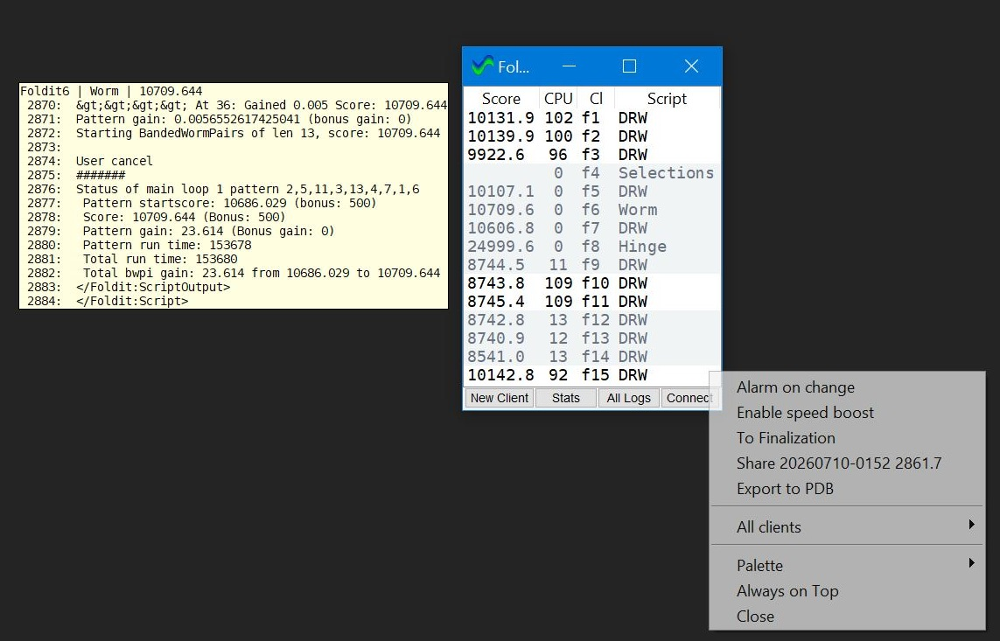
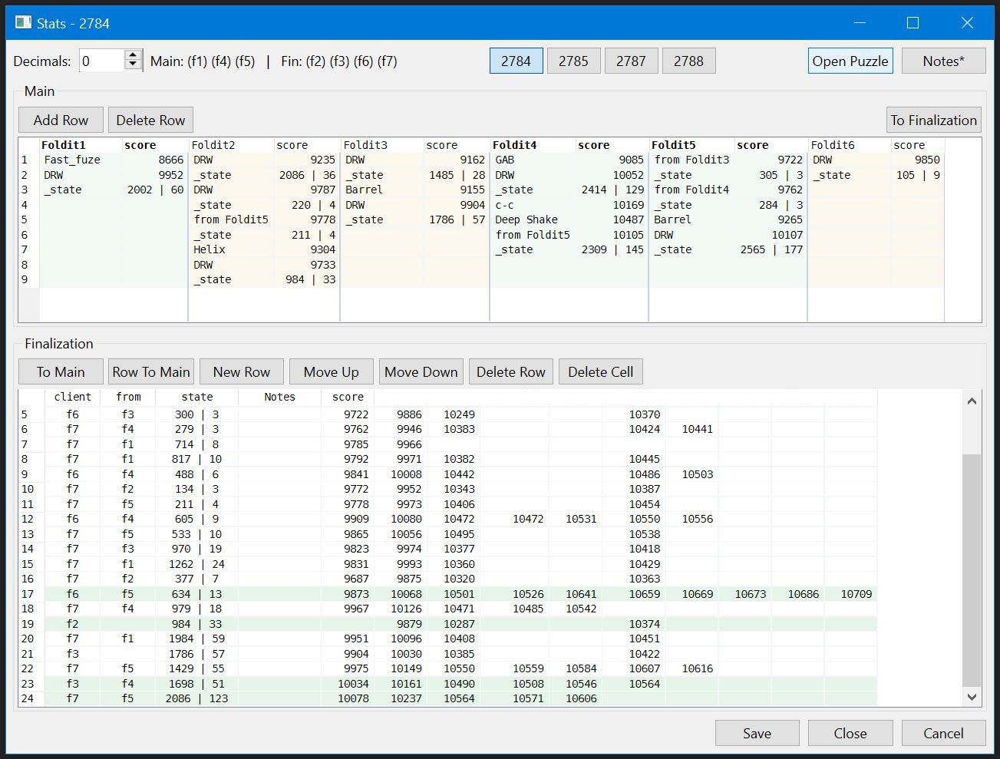

# FolditMonitor

FolditMonitor is a small desktop helper for watching local Foldit clients, tracking scores/log output, viewing puzzle stats, and connecting monitors over the local network.

## Screenshots





## Contents

- `Foldit Monitor.pyw` - main Tk application.
- `settings.py` - defaults and runtime settings handling.
- `network.py` - local network sync and artifact transfer.
- `stats_*.py`, `logger.py`, `log_lookup.py` - score/log parsing and stats UI.
- `foldit_speed_boost*.py` - optional Frida-based speed boost integration.
- `alert.wav` - default alert sound.
- `tests/` - unit tests.

Runtime folders such as `logs/`, `puzzle_logs/`, `foldit_backup/`, `__pycache__/`, and the generated `Foldit Monitor.json` are intentionally not tracked.

## Requirements

- Windows with Python 3.11+.
- Foldit clients running locally.
- Python packages from `requirements.txt`.

## Install

```powershell
python -m pip install -r requirements.txt
```

## Run

```powershell
pythonw "Foldit Monitor.pyw"
```

For console output while debugging:

```powershell
python "Foldit Monitor.pyw"
```

On first start the app creates `Foldit Monitor.json` from defaults. That file stores local window positions, last selected puzzle, network address, and other user preferences, so it is ignored by git.

`Foldit Monitor.example.json` is a clean default settings example.

## Test

```powershell
python -m unittest discover -s tests
```
